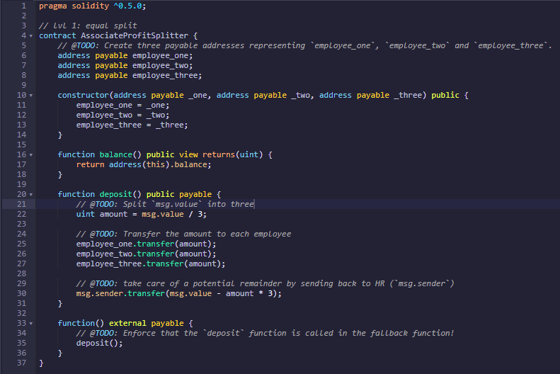
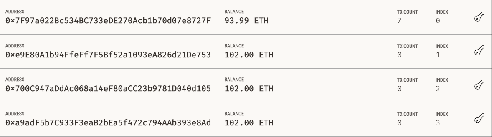
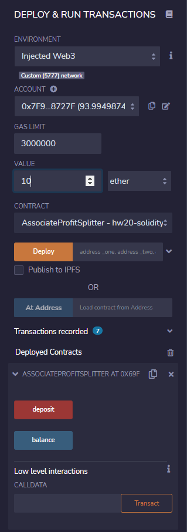
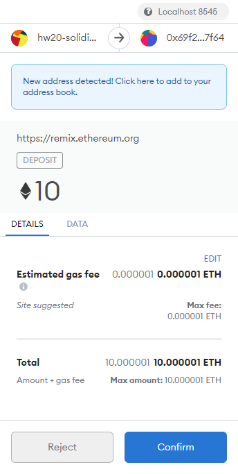
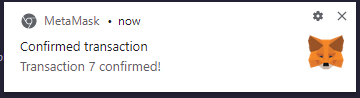
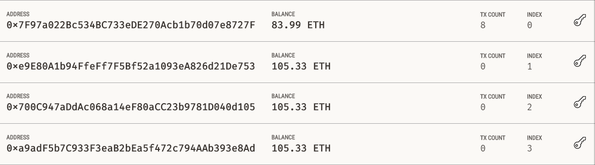

# Unit 20 - "Looks like we've made our First Contract!"

---

## Lv1: Associated Profit Splitter
*[`AssociateProfitSplitter.sol`](Code/AssociateProfitSplitter.sol) -- Level 1 starter code.*

This contract facilitates the payment of employee wages in a fast and efficient manner. Ether profits are evenly distributed among three associate-level employees. Any Ether remaining after the split is sent back to HR. The program is built in Solidity, and transactions are sent using Remix and MetaMask.

After building the contract in Remix, it is compiled under version `0.5.0` and deployed with three account addresses added. The box labeled "Value" is kept at 0 when first deploying the contract.

The "Value" is then filled with the amount to be deposited, and the "deposit" button under "Deployed Contracts" will run the transaction. 

A prompt from MetaMask will ask to confirm the transaction, and a pop up will show that the transaction is successful.

Once it is run, the designated amount (plus gas fees) is removed from the primary account and distributed 

---

## Lv2 Tiered Splitter
* [`TieredProfitSplitter.sol`](Code/TieredProfitSplitter.sol) -- Level 2 starter code.

---

##Lv3 Deferred Equity Plan
* [`DeferredEquityPlan.sol`](Code/DeferredEquityPlan.sol) -- Level 3 starter code.