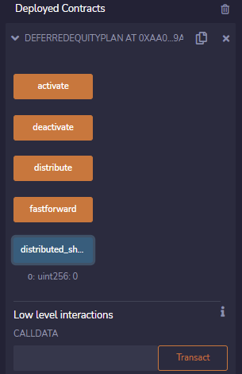

# Unit 20 - "Looks like we've made our First Contract!"

*Jump to:*
[Level 1: Associate Profit Splitter](#level-1-associate-profit-splitter)
[Level 2: Tiered Splitter](#level-2-tiered-splitter)
[Level 3: Deferred Equity Plan](#level-3-deferred-equity-plan)
[Kovan Testnet](#kovan-testnet)

---

## Level 1: Associate Profit Splitter
*[AssociateProfitSplitter.sol](Guidelines/Starter-Code/AssociateProfitSplitter.sol) -- Level 1 starter code.*

This contract facilitates the payment of employee wages in a fast and efficient manner. Ether profits are evenly distributed among three associate-level employees. Any Ether remaining after the split is sent back to HR. The program is built in Solidity, and transactions are sent using Remix and MetaMask.

After building the contract in Remix, it is compiled under version `0.5.0` and deployed with three account addresses added. These addresses are generated from Ganache.

The box labeled "Value" is kept at 0 when first deploying the contract, and it is then filled with the amount to be divided among the accounts (in this case `10 ether`). The "deposit" button under "Deployed Contracts" will run the transaction. 

A prompt from MetaMask will ask to confirm the transaction, and a pop up will show that the transaction is successful.

Once it is run, the designated amount (plus gas fees) is removed from the primary account and distributed 

---

## Level 2: Tiered Splitter
*[TieredProfitSplitter.sol](Guidelines/Starter-Code/TieredProfitSplitter.sol) -- Level 2 starter code.*

This contract, much like the Associate Profit Splitter, distributes profits among three employees. These employees rank differently within the company, therefore their compensation is broken up into different percentages rather than split evenly three ways.

The contract is built similar to first, though this time the value is divided by 100 in order to create simple percentage-based calculations. The CEO is compensated 60%, the CTO 25%, and Bob gets 15%; any remainder returns to HR.

The three employees have a starting balance 100 ether in each of their accounts.

Once compiled and deployed, the contract appears in the "Deployed Contracts" section at the bottom of the menu. After a value is set, a deposit can be made.

As illustrated below, out of the 10 ether, the CEO received 6 (60%), the CTO received 2.5 (25%), and Bob received 1.5 (15%).

The "balance" function can test whether the "deposit" function is working properly. It should not store any value of Ether when deposits are made, and should always return a `0` value.

---

## Level 3: Deferred Equity Plan
* [DeferredEquityPlan.sol](Guidelines/Starter-Code/DeferredEquityPlan.sol) -- Level 3 starter code.

This contract manages a deferred equity incentive plan. An employee will receive 1000 shares that are distributed over the course of 4 years, equalling 250 shares after every year. Should the employee leave within the first 4 years, they would forfeit ownership of any remaining ("unvested") shares.

It's important to note that this contract will not deal with any ether, and so the value should be kept at 0. However, an empty function at the end of the contract reverts any ether sent to the contract directly.

The main functions to take note of under "Deployed Contracts" are `distribute`, `distributed_shares`, and, for testing purposes, `fastforward`. Under `distributed_shares`, the `uint256` value is still 0, showing that no shares have been awarded yet. There are also functions to `deactivate` or `reactivate` the contract at-will, accessible only by `human_resources` or the `employee`.

Because the contract includes a timelock, the `fastforward` function and `fakenow` variable will allow for skipping time in order to test that shares are only distributed at expected intervals.

Should there be an attempt to `distribute` shares before at least 365 days have passed, the contract will return an error stating "Shares have not been vested yet!" to the console.

After a year has passed (or when testing the contract, artificially increasing the value of `fakenow`), the vested 250 shares can be distributed to the employee.

Once the employee has received their 1000 shares after 4 years (and an extra function) have gone by, the contract will not release any more shares.

---

## Kovan Testnet
The Tiered Profit Splitter was used to test transactions over the Kovan testnet. After deploying the contract..

..a transaction of 10 finney is sent over the testnet to three accounts.

Success! The profits are distributed accordingly, split into 60%, 25%, and 15%.
